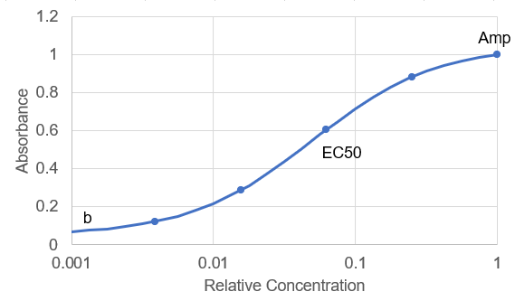

## Serology data analysis with Python for ELISA Antibody Detection
*Jay Unruh*

*Disclaimer and License:*

This software is provided as is with no guarantee of functionality or support.  Note that all clinical diagnoses must follow CDC protocols and be verified by visual inspection.  This software is only a tool to aid in that process and its metrics should never be used without visual verification.

The license for this software is the GNU GPL version 2 license (see license file) which requires all derivative code to be open source as well.  Please contact jru@stowers.org to inquire about non-open source licensing.

*Introduction:*

Serology data analysis is straightforward in principle.  One titrates a serum sample into buffer until signal (absorbance) above background is no longer observed.  This is referred to as the titer.  Unfortunately variations in sample-to-sample background levels and the desire to measure low antibody levels make this more complicated.

The methodology behind this software is based on fitting curves to a simple equilibrium binding model:

*Amp*(*c*) = b+*A \* c*/[*EC50*+*c*].

Here *A* is the asymptotic amplitude of the signal, *EC50* is the relative concentration at which 50% of signal is obtained,*c* is the relative concentration, and *b* is the background signal.  Here is a graphical representation of this curve:

The *EC50* value is in principle a variable related to titer but this value is poorly determined when binding is either saturated (high titer) or doesn't occur at all (*EC50* approaches infinity).  In particular we are interested in high sensitivity to small amounts of antibody in low titer samples. That sensitivity is achieved by measuring the area under the curve (AUC) which is simply the integral over the titration curve (ref?).  That value is determined as follows:

*AUC* = *Amp* \* (*Cmax* - *EC50* \* ln[*Cmax*+*EC50*]+*EC50* \* ln[*EC50*])

Here *Cmax* is the maximum concentration in the dilution series.  A few notes should be made as to the algorithm used for fitting.  The software uses a grid search algorithm with a non-linear search accomplished by multiplying the EC50 value by 1.05 at each iteration.  *EC50* values are searched from half of the minimum concentration in the series to 5 times the maximum concentration in the series.  Monte carlo error analysis is performed by repeating the fit 50 times on data simulated from the best fit and Gaussian random numbers produced according to the distribution of residuals.

Reference:
1.	Yu X, Gilbert PB, Hioe CE, Zolla-Pazner S, Self, SG. Statistical approaches to analyzing HIV-1 neutralizing antibody assay data. Stat Biopharm Res. 2012;4:1.

*File Organization/Format:*

Raw absorbance values are assumed to be in an excel worksheet with each well occupying a row.  No discrimination is made between control and sample rows: such analysis must be done by downstream processing.  The code should be in a folder entitled "code" at the same level in the folder structure as the folder containing the plate data.

*Software description:*

The software is written in python with jupyter notebooks for visualization and report generation.  Pandas dataframes with numpy are used for data manipulation and matplotlib and holoviews (via bokeh) are used for visualization purposes.  Installation of miniconda3 and those packages according to conda installation protocols should be sufficient to run the code.

Most of the code is in the serology_analysis_functions.py file which relies on NLLSfit.py and FitHill.py for fitting.  Those files reside in a folder entitled "code".  The analysis and fitting takes place in 384_dilution_analysis.ipynb which should be in a folder for that plate that also includes the excel plate data.  Running that notebook fully will produce an html file with the same name that can be used statically to show results on machines without python installed.  You may have to save the notebook and rerun the last cell to get the html to generate correctly. That notebook will also produce serology_analysis_results1.csv and serology_traces1.csv files that can be used for downstream analysis and visualization.